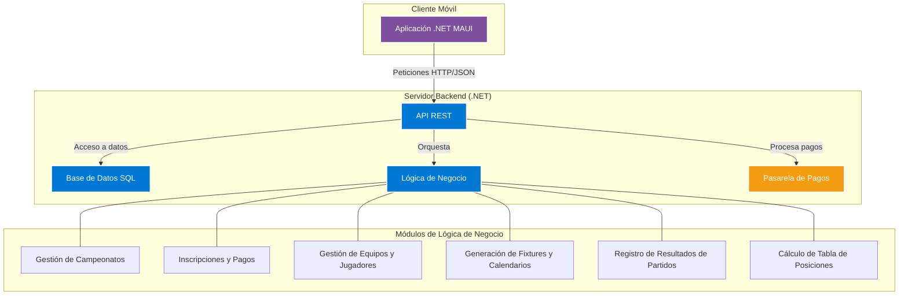

```mermaid
graph TD
    subgraph "Cliente Móvil"
        A[Aplicación .NET MAUI]
    end

    subgraph "Servidor Backend (.NET)"
        B[API REST]
        C[Base de Datos SQL]
        D[Lógica de Negocio]
        E[Pasarela de Pagos]
    end

    A -- Peticiones HTTP/JSON --> B
    B -- Acceso a datos --> C
    B -- Orquesta --> D

    subgraph "Módulos de Lógica de Negocio"
        D1[Gestión de Campeonatos]
        D2[Inscripciones y Pagos]
        D3[Gestión de Equipos y Jugadores]
        D4[Generación de Fixtures y Calendarios]
        D5[Registro de Resultados de Partidos]
        D6[Cálculo de Tabla de Posiciones]
    end

    D --- D1
    D --- D2
    D --- D3
    D --- D4
    D --- D5
    D --- D6
    
    B -- Procesa pagos --> E

    style A fill:#7D4F9D,stroke:#FFF,stroke-width:2px,color:#FFF
    style B fill:#0078D4,stroke:#FFF,stroke-width:2px,color:#FFF
    style C fill:#0078D4,stroke:#FFF,stroke-width:2px,color:#FFF
    style D fill:#0078D4,stroke:#FFF,stroke-width:2px,color:#FFF
    style E fill:#F39C12,stroke:#FFF,stroke-width:2px,color:#FFF
```
